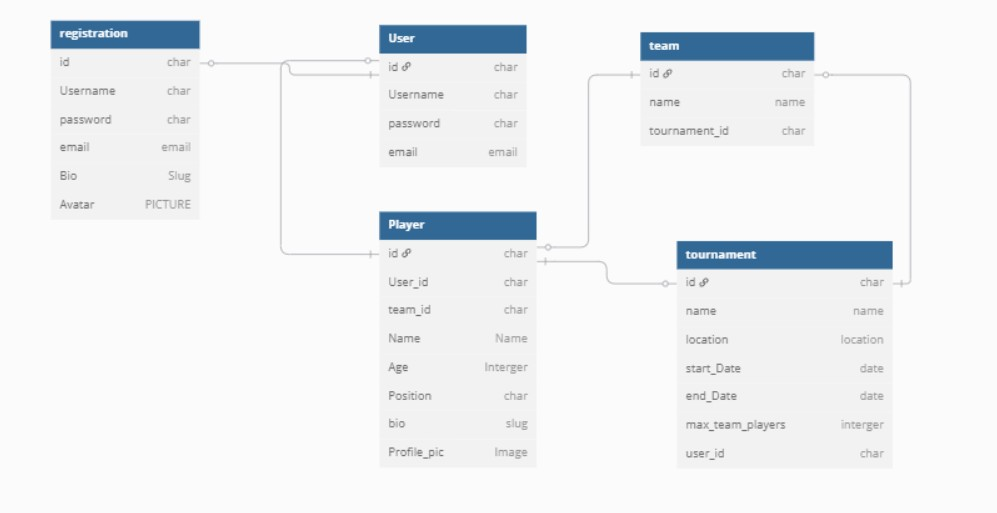

# project_tournament

## Contents
* [User Experience](#user-experience-ux)

* [Technologies Used](#technologies-used)
  * [Languages Used](#languages-used)
  * [Frameworks, Libraries & Programs Used](#frameworks-libraries--programs-used)

* [Deployment & Local Development](#deployment--local-development)
  * [Deployment](#deployment)
  * [Local Development](#local-development)

* [Testing](#testing)
  * [Manual Test](#manual-test)
  * [Vaildation Test](#vaildation-test)
  
* [Credits](#credits)
  * [Content](#content)
 
  ---

## User Experience (UX)

### User:
Sporting organisers: Ability to get events uploaded for one off or repeat tournaments. 
User: To explore up and coming sporting tournaments and register interest. 

##### Client goals:
* To enable people to explore all sporting tournaments for both team and individual sports. 

##### First Time Vistors:
* Simple follow along layout navigates the user seemlessly through the game without any diversion.
* Easy registration 
---

### Flowchart:

---

## Technologies Used:

### Languages Used:
Python
Bootstrap
Django 
Html
CSS

### Frameworks, Libraries & Programs used: 

Frameworks and Libraries:
*Github-Database
*dbdiagram.io
*PostgreSQL from Code Institute.

Features:
*Registration 
*Individual Profiles
*Login and Logout/ password reset
*Team and Individual Registration
*Tournament list
*Tournament search and filtering
*Pagination on tournament listings
*Admin controls

## Deployment & Local Development

### Deployment:
The site is deployed using Heroku. Visit the deployed site [tournamnets](https://dashboard.heroku.com/apps/tournaments) To deploy using Heroku pages:

1. Login or Sign Up to Heroku.
2. Open the project repository.
3. Click on "Open App"

### How to Fork
To fork the repository:

Log in (or sign up) to Github.
Go to the repository for this project, [Project Tournaments](https://github.com/DpWhitt6/project_tournament/deployments).
Click the Fork button in the top right corner.

### How to Clone
To clone the repository:

Log in (or sign up) to GitHub.
Go to the repository for this project, [Project Tournaments](https://github.com/DpWhitt6/project_tournament/deployments).
Click on the code button, select whether you would like to clone with HTTPS, SSH or GitHub CLI and copy the link shown.
Open the terminal in your code editor and change the current working directory to the location you want to use for the cloned directory.
Type 'git clone' into the terminal and then paste the link you copied in step 3. Press enter.

## Testing:

### Manual Test:
|Manual Testing platform|
(

### Bugs:
|Bug|Solution|
|--|--|
|Repaired||
|Repaired||
|Repaired||
|Repaired||
|Repaired||
|On going - heroku depolyment||
### Vaildation Test:
|HTML||
|base.html||
|Profile_update.html||
|register.html||
|login.html||
|logout.html||
|password_reset.html||
|create_tournament.html||
|register_individuals.html||
|register.html||
|tournament_detail.html||
|tournament_list||
|CSS||
|style.css||
|Python||
|Accounts - Models.py||
|Accounts - view.py||
|Accounts - form.py||
|Tournaments - Models.py||
|Tournaments  - view.py||
|Tournaments  - form.py||
---

## Credits:
### Content
|Content | Credit |
|--|--|
|Blog Walkthrough Project|Multiple blogs|
|Stack overflow|Multiple blogs|
|geekdforgeeks|Multiple blogs|
|Reddit|Multiple blogs|
|Bootsrap Library||
|Django Library||
